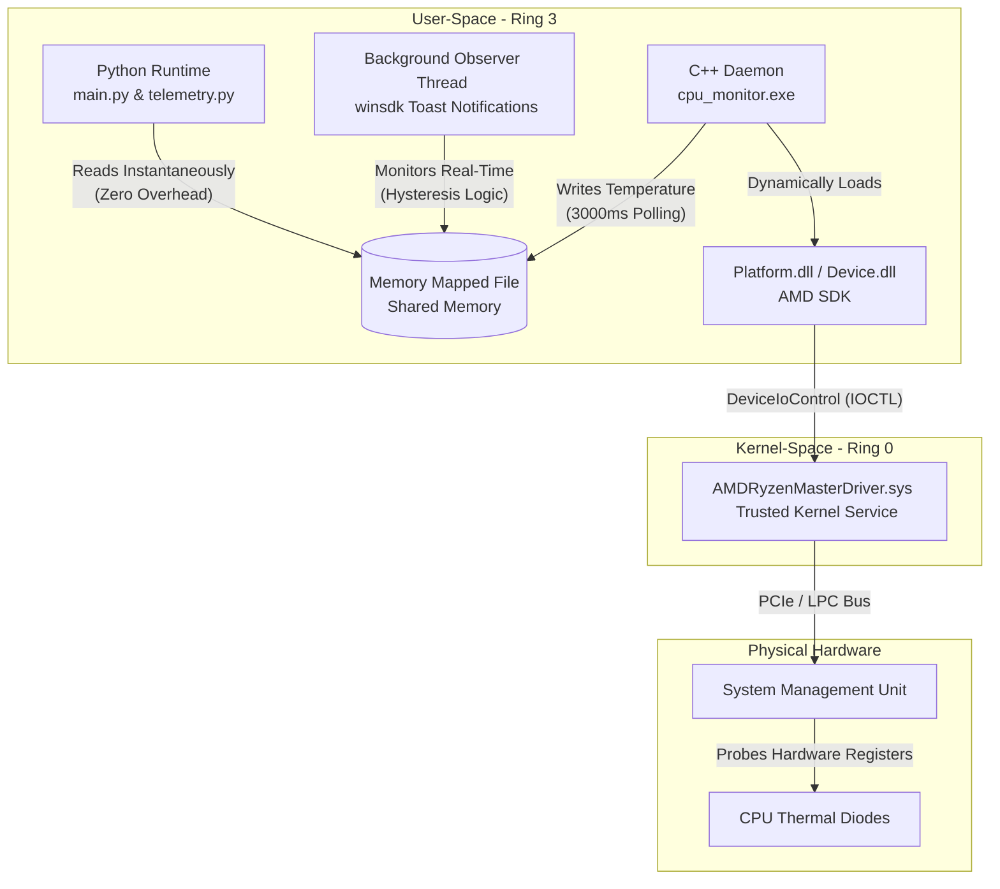

# Architecture & OS Internals

The following text details the underlying mechanics and API hooks utilized within the codebase. The core philosophy centers on avoiding abstracted desktop managers and interacting directly with fundamental operating system mechanisms.

## 1. LLM Reasoning Integration

Hardcoded intent routing is avoided. The architecture utilizes SDK-level function calling. A schema of available OS hooks is provided to the generative model. Upon receiving input, the model determines which native tool to invoke, mapping natural language to Win32/WinRT bindings. Execution results are piped back to the generative engine to format the final output.

## 2. Desktop Window Manager (DWM) Z-Order Traversal
**File:** `tools.py` -> `get_active_window()`, `read_active_window_content()`

When executing a command-line interface, the "active window" defaults inherently to the terminal process. Deducing the actual target application requires ignoring the terminal wrapper and crawling the DWM Z-order stack.
- A hook into `user32.dll` is established via `ctypes`.
- The foreground window is retrieved and the associated Process ID is evaluated.
- If the Process ID matches the executing terminal wrapper, traversal proceeds downward using `GetWindow(hwnd, GW_HWNDNEXT)`.
- Minimized (`IsIconic`) windows are explicitly ignored. Bare desktop shells (`WorkerW`, `Progman`) are intercepted to accurately deduce the target application.
- Parsing the title of the underlying window permits extraction of active code editor filenames, facilitating filesystem traversal and raw disk reads.

## 3. WinRT System Media Transport Controls (SMTC)
**File:** `tools.py` -> `control_system_media()`

Modern media control is routed through the asynchronous WinRT pipeline rather than via simulated keypresses.
- The `winsdk` projection accesses `Windows.Media.Control`.
- Because the global SMTC session is often dominated by web browsers, target applications are resolved explicitly.
- By utilizing `manager.get_sessions()`, iteration over all suspended or background media sessions occurs. Comparing the `source_app_user_model_id` allows transport signals (play/pause) to be piped specifically to background applications, bypassing the dominant DWM session.

## 4. WMI ACPI Probing & Native Telemetry
**File:** `tools.py` -> `get_system_stats()`, `get_hardware_details()`

Hardware telemetry is gathered by bypassing high-level wrappers and querying the Common Information Model (CIM) and Windows Management Instrumentation (WMI).
- Central processing and memory metrics are extracted natively.
- For thermal data, direct probes of user-space ACPI thermal zones (`MSApi_ThermalZoneTemperature`) fail on custom motherboards due to a lack of standard ACPI routing. To circumvent this Ring-3 sandbox limitation, a custom C++ daemon (`cpu_monitor`) is deployed.
- The daemon dynamically loads the AMD Ryzen Master SDK (`Platform.dll`) to establish a persistent session with the official AMD Ring-0 kernel driver (`AMDRyzenMasterDriver.sys`).
- To avoid the severe CPU penalty of cold-booting the kernel session and querying the hardware System Management Unit (SMU) upon every telemetry request, the C++ daemon is designed as a persistent background process. It is eagerly initialized by `main.py` during Kiko's boot sequence. The daemon polls the hardware natively every 3000ms and exposes the live temperature via a Memory Mapped File (Shared Memory), allowing the Python runtime to read the sensors instantaneously with zero overhead.
- An independent Python background thread runs continuously alongside Kiko's LLM evaluation loop, monitoring this shared memory block. By utilizing a Schmitt trigger pattern (hysteresis logic), it can autonomously fire native Windows Toast Notifications via `winsdk` when thermal thresholds are crossed, bypassing the blocking LLM `input()` prompt completely.
- Native PowerShell `Get-CimInstance` queries remain in place as a generic fallback for exposing underlying hardware IDs and manufacturers.

### Telemetry Data Flow Architecture

## 5. Direct Process Termination
**File:** `tools.py` -> `force_kill_process()`

Polite application closure requests are omitted in favor of kernel-level termination signals using `taskkill /F`. Such termination forcefully removes the target process from memory, neutralizing hanging threads and unresponsive GUI prompts.

## 6. Registry-Based Executable Resolution
**File:** `tools.py` -> `launch_program()`

Relying on the `start` shell command triggers GUI error dialogs when an executable is missing. Executable resolution is handled manually:
1. Native `PATH` probing occurs first.
2. Upon failure, local machine and user Registry hives (`SOFTWARE\Microsoft\Windows\CurrentVersion\Uninstall` and WOW6432Node) are crawled.
3. Iterating through Uninstall keys, `DisplayIcon` or `InstallLocation` string values are read to deduce the physical path of the binary on disk.
4. A detached GUI process is spawned (`creationflags=0x00000008`), preventing the spawned application from inheriting file handles and deadlocking the terminal.
