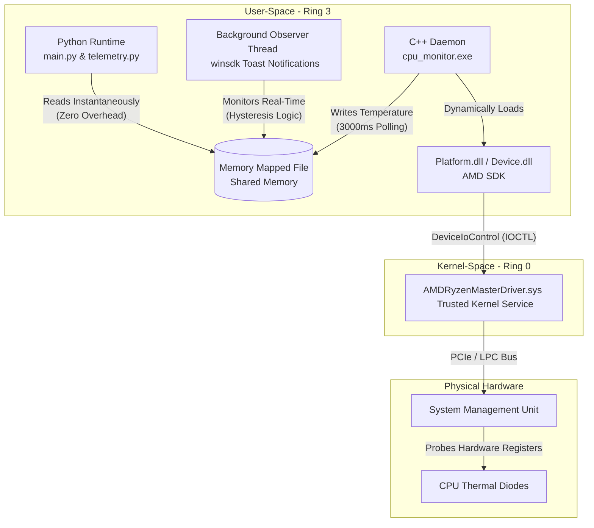

# Architecture & OS Internals

The following text details the underlying mechanics and API hooks utilized within the codebase. The core philosophy centers on avoiding abstracted desktop managers and interacting directly with fundamental operating system mechanisms.

## 1. LLM Reasoning Integration

Hardcoded intent routing is avoided. The architecture utilizes SDK-level function calling. A schema of available OS hooks is provided to the generative model. Upon receiving input, the model determines which native tool to invoke, mapping natural language to Win32/WinRT bindings. Execution results are piped back to the generative engine to format the final output.

## 2. Desktop Window Manager (DWM) Z-Order Traversal
**File:** `tools.py` -> `get_active_window()`, `read_active_window_content()`

When executing a command-line interface, the "active window" defaults inherently to the terminal process. Deducing the actual target application requires ignoring the terminal wrapper and crawling the DWM Z-order stack.
- A hook into `user32.dll` is established via `ctypes`.
- The foreground window is retrieved and the associated Process ID is evaluated.
- If the Process ID matches the executing terminal wrapper, traversal proceeds downward using `GetWindow(hwnd, GW_HWNDNEXT)`.
- Minimized (`IsIconic`) windows are explicitly ignored. Bare desktop shells (`WorkerW`, `Progman`) are intercepted to accurately deduce the target application.
- Parsing the title of the underlying window permits extraction of active code editor filenames, facilitating filesystem traversal and raw disk reads.

## 3. WinRT System Media Transport Controls (SMTC)
**File:** `tools.py` -> `control_system_media()`

Modern media control is routed through the asynchronous WinRT pipeline rather than via simulated keypresses.
- The `winsdk` projection accesses `Windows.Media.Control`.
- Because the global SMTC session is often dominated by web browsers, target applications are resolved explicitly.
- By utilizing `manager.get_sessions()`, iteration over all suspended or background media sessions occurs. Comparing the `source_app_user_model_id` allows transport signals (play/pause) to be piped specifically to background applications, bypassing the dominant DWM session.

## 4. WMI ACPI Probing & Native Telemetry
**File:** `tools.py` -> `get_system_stats()`, `get_hardware_details()`

Hardware telemetry is gathered by bypassing high-level wrappers and querying the Common Information Model (CIM) and Windows Management Instrumentation (WMI).
- Central processing and memory metrics are extracted natively.
- For thermal data, direct probes of user-space ACPI thermal zones (`MSApi_ThermalZoneTemperature`) fail on custom motherboards due to a lack of standard ACPI routing. To circumvent this Ring-3 sandbox limitation, a custom C++ daemon (`cpu_monitor`) is deployed.
- The daemon dynamically loads the AMD Ryzen Master SDK (`Platform.dll`) to establish a persistent session with the official AMD Ring-0 kernel driver (`AMDRyzenMasterDriver.sys`).
- To avoid the severe CPU penalty of cold-booting the kernel session and querying the hardware System Management Unit (SMU) upon every telemetry request, the C++ daemon is designed as a persistent background process. It is eagerly initialized by `main.py` during Kiko's boot sequence. The daemon polls the hardware natively every 3000ms and exposes the live temperature via a Memory Mapped File (Shared Memory), allowing the Python runtime to read the sensors instantaneously with zero overhead.
- An independent Python background thread runs continuously alongside Kiko's LLM evaluation loop, monitoring this shared memory block. By utilizing a Schmitt trigger pattern (hysteresis logic), it can autonomously fire native Windows Toast Notifications via `winsdk` when thermal thresholds are crossed, bypassing the blocking LLM `input()` prompt completely.
- Native PowerShell `Get-CimInstance` queries remain in place as a generic fallback for exposing underlying hardware IDs and manufacturers.

### Telemetry Data Flow Architecture

## 5. Direct Process Termination
**File:** `tools.py` -> `force_kill_process()`

Polite application closure requests are omitted in favor of kernel-level termination signals using `taskkill /F`. Such termination forcefully removes the target process from memory, neutralizing hanging threads and unresponsive GUI prompts.

## 6. Registry-Based Executable Resolution
**File:** `tools.py` -> `launch_program()`

Relying on the `start` shell command triggers GUI error dialogs when an executable is missing. Executable resolution is handled manually:
1. Native `PATH` probing occurs first.
2. Upon failure, local machine and user Registry hives (`SOFTWARE\Microsoft\Windows\CurrentVersion\Uninstall` and WOW6432Node) are crawled.
3. Iterating through Uninstall keys, `DisplayIcon` or `InstallLocation` string values are read to deduce the physical path of the binary on disk.
4. A detached GUI process is spawned (`creationflags=0x00000008`), preventing the spawned application from inheriting file handles and deadlocking the terminal.

## 7. Hybrid Memory Cortex (Native RAG)
**File:** `tools/memory.py`

To provide long-term state across sessions, Kiko utilizes a dual-layer SQLite memory architecture, intentionally bypassing abstracted vector frameworks like Langchain or ChromaDB to keep the mechanical process transparent.
- **Explicit Identity Store:** A traditional Key-Value table (`core_preferences`) persists explicit facts about the user. These can be retrieved dynamically or injected into the system prompt upon boot.
- **Fuzzy Semantic Engine (RAG):** Conversational history is continuously embedded via the Gemini API (generating 3072-dimensional arrays). The resulting float arrays are packed into raw C-level binary BLOBs using `struct.pack('f' * 3072, ...)` and committed to the `semantic_memory` table.
- **Native Retrieval:** Upon each user prompt, the query is embedded and evaluated against the database using a brute-force linear Cosine Similarity scan in pure Python. The dot-product and magnitude calculations isolate the most contextually relevant historical exchange, which is seamlessly injected into the LLM's context window prior to generating a response.

## 8. Autonomous Web Scraping & Bot Evasion
**File:** `tools/search.py`

To circumvent LLM hallucinations without relying on expensive, rate-limited third-party search APIs (like SerpAPI), Kiko is equipped with a custom-built, standard-library scraper.
- **Bot Evasion:** Standard `GET` requests to modern search engines quickly result in IP-based CAPTCHA blocks (Cloudflare anomaly pages). To bypass this, the scraper targets the ultra-lightweight `lite.duckduckgo.com/lite/` endpoint using `POST` requests and URL-encoded query payloads.
- **Header Rotation:** A local dictionary of diverse `User-Agent` strings (`user_agents.json`) is maintained. A random UA is injected into the HTTP headers for every request to further obfuscate the scraping activity and simulate real browser heterogeneity.
- **State-Machine HTML Parsing:** Abstracted dependencies like `BeautifulSoup` are purposefully avoided. Instead, a custom state machine inherits from the standard library `html.parser.HTMLParser`. As the raw DOM stream is ingested, the engine dynamically tracks `<td>` tags possessing the `result-snippet` class. 
- **Fragment Buffering:** Because `HTMLParser` fractures data streams upon encountering inner semantic tags (like `<b>` elements highlighting search terms), the state machine actively buffers raw string fragments into a continuous block in memory. It only appends the finalized, assembled snippet to the results array once the enclosing `<td>` tag formally terminates.
- **Two-Stage Crawling:** Scraping snippets alone often lacks sufficient context. The `DuckDuckGoParser` additionally extracts the underlying `href` from the `<a class="result-link">` tag. The scraper then automatically initiates a secondary, deep-dive `GET` request (using the same forged headers) to download the target webpage's complete HTML payload.
- **Event-Driven DOM Stripping:** To prevent the massive HTML overhead of target webpages from crashing the LLM's context window, a second state machine (`WebContentParser`) is deployed. Taking advantage of `HTMLParser`'s event-driven callback architecture, it flips a boolean flag upon encountering `<script>`, `<style>`, or metadata opening tags. The `handle_data` event actively ignores incoming streams while this flag is active, mechanically throwing away all backend code and styling rules on the fly with zero memory overhead. The resulting pure text is capped at 3000 characters and injected directly into Kiko's context window alongside the DuckDuckGo snippets.

## 9. Global Master File Table (MFT) Scanner
**File:** `mft_scanner/fast_search.cpp`, `mft_scanner/__init__.py` -> `perform_global_search()`

To provide instantaneous, system-wide file search without relying on the slow Windows Indexing Service, Kiko hooks directly into the NTFS Master File Table.
- **Kernel-Level MFT Access**: A custom C++ executable leverages `DeviceIoControl` with `FSCTL_ENUM_USN_DATA` to read raw MFT entries directly from disk sectors, entirely bypassing high-level user-space directory traversal.
- **Dynamic Drive Enumeration**: The Python wrapper utilizes `psutil.disk_partitions()` to dynamically discover all physically mounted NTFS volumes (e.g., `C:`, `D:`, `E:`). The C++ executable is sequentially fired across all attached drives natively, completely eliminating the need to hardcode search partitions.
- **Path Resolution**: Because `FSCTL_ENUM_USN_DATA` returns raw 64-bit File Reference Numbers (FRNs) without directory hierarchy, the scanner dynamically translates FRNs into absolute paths by combining `OpenFileById` (with `FILE_FLAG_BACKUP_SEMANTICS`) and `GetFinalPathNameByHandleW`. 
- **Tokenized Fuzzy Substring Search**: Rather than enforcing exact string matches, the search query is fractured into lowercase tokens. The scanner sequentially streams through the raw byte buffer of the MFT in memory, performing a multi-keyword fuzzy substring match against every file record. This allows Kiko to resolve complex user requests (e.g., "devops resume") into exact physical files (e.g., `RajatRaj_Resume_DevOps.pdf`) instantaneously.

## 10. Agentic PDF Analysis (LangGraph Sub-Agent)
**File:** `tools/pdf_rag.py` -> `advanced_pdf_query()`

To prevent large PDF documents from saturating the LLM context window or crashing token limits, Kiko delegates PDF reading to an autonomous LangGraph sub-agent flow.
- **Ephemeral FAISS Memory**: Kiko specifically avoids persistent, bloated databases like ChromaDB for document reads. PDFs are loaded via `PyPDFLoader`, chunked using `RecursiveCharacterTextSplitter`, and piped into a transient FAISS in-memory index that is deliberately cleared upon application exit.
- **CPU-Optimized Embeddings**: Rather than making expensive API round-trips to Gemini to embed massive PDFs, the tool leverages `HuggingFaceEmbeddings` (`all-MiniLM-L6-v2`) via `sentence-transformers`. This generates ultra-fast, 384-dimensional dense vectors natively on the host's CPU.
- **LangGraph Routing**: The sub-agent compiles a lightweight `StateGraph` which retrieves the top `k` semantically relevant chunks. These high-fidelity text segments are formatted and passed natively back into Kiko's main reasoning loop, enabling precise question-answering without exposing the parent model to the raw file bytes.

## 11. Silent Filesystem Inspection
**File:** `tools/windowing.py` -> `list_directory_contents()`

Rather than aggressively launching visual GUI windows (via `os.startfile`) every time Kiko needs to examine a directory, a discrete parsing tool allows her to ingest folder contents silently.
- Queries `os.listdir()` to enumerate physical file entries.
- Returns a raw text payload directly into the LLM's context window.
- **Contextual Optimization Loop**: If the LLM observes that a requested target file rests in the currently inspected directory, it bypasses the heavy global MFT scan. It constructs the absolute path natively in-memory and launches the target file instantaneously with zero intermediate graphical disruption.
